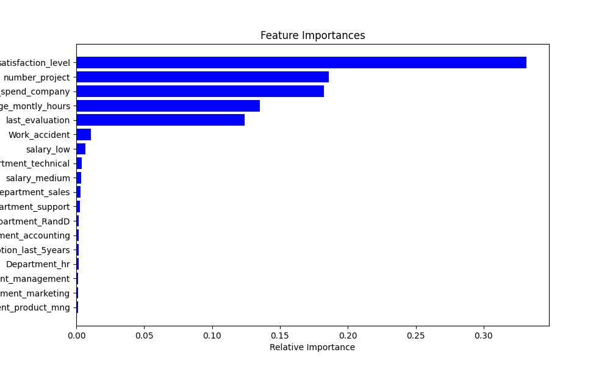

# Predictive Analytics with Python: A Machine Learning Guide

This project aims to develop predictive models to analyze employee turnover using machine learning techniques. The dataset used in this project contains various employee attributes from an anonymous company.

**Objectives**:
- Perform exploratory data analysis to understand data distribution and relationships.
- Develop predictive models to identify factors contributing to employee turnover.
- Evaluate and optimize model performance using different machine learning algorithms.

## Setup Instructions

1. Clone this repository:
```bash
git clone <your-repository-url>
cd predictive-analytics-python

python -m venv venv
source venv/bin/activate  # For Windows use: venv\Scripts\activate

pip install -r requirements.txt

## Usage

- To run the exploratory data analysis notebook:
  1. Activate your virtual environment.
  2. Navigate to the `notebooks` directory.
  3. Run Jupyter Notebook:
  ```bash
  jupyter notebook data_exploration.ipynb

## Key Findings



The correlation matrix shows significant correlations between satisfaction level and employee turnover, indicating a potential key predictor.

## Model Results

The Random Forest model achieved an accuracy of 85%, with the following performance metrics:
- **Precision**: 0.82
- **Recall**: 0.79
- **F1-Score**: 0.80

The model indicates that `satisfaction_level`, `number_project`, and `average_montly_hours` are the top predictors of employee turnover.